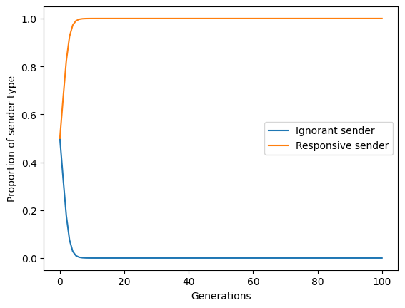
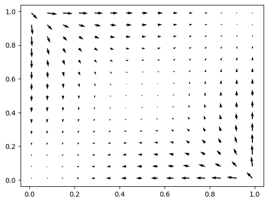

Usage
=====

Requirements
------------

Evoke currently requires Python versions 3.9-3.12.
Further requirements are listed in the source repository's `pyproject.toml <https://github.com/signalling-games-org/evoke/blob/main/pyproject.toml>`_.

Installation
------------

To use Evoke, first install it using pip:

.. code-block:: console

   (.venv) $ pip install evoke_signals

Tutorial
--------

The best way to discover Evoke is `the interactive tutorial <https://colab.research.google.com/drive/1AwUCP05lpITAP7_EZD7loGv3unhnwvhM#forceEdit=true&sandboxMode=true>`_.
The rest of this document describes very simple use cases.

Creating signalling games
-------------------------

Creating signalling game simulations requires two kinds of object:

- **game**: This describes properties of the game, including the probabilities of each observable state, the number of signals available, and the payoff matrices of sender and receiver.
- **evolve**: This describes properties of the evolutionary scenario, especially whether the 'agents' are populations evolving via selection or individuals learning via reinforcement.

Games and evolve objects can be mixed and matched.
This allows you to see differences between evolution and reinforcement learning, by taking the same game and plugging it into different evolve objects.

Take the simple example of a cooperative game with three states, three signals and three acts (the following code examples can also be found in the `tutorial <https://colab.research.google.com/drive/1AwUCP05lpITAP7_EZD7loGv3unhnwvhM#forceEdit=true&sandboxMode=true&scrollTo=304dd76f>`_).
First, in order to create the **game** object, we need to supply Evoke with four pieces of information:

- `state_chances`: The number of states the sender can observe, and their probabilities. For this example there will be three equiprobable states.
- `sender_payoff_matrix` and `receiver_payoff_matrix`: Matrices defining the payoffs of sender and receiver. For this example they will be the same: when the state matches the act, both agents get a payoff of 1, otherwise they get a payoff of zero.
- `messages`: The number of messages available for the sender to send, which in this example is three.

.. code-block:: python

    state_chances = np.array([1/3, 1/3, 1/3])
    sender_payoff_matrix = np.eye(3)
    receiver_payoff_matrix = np.eye(3)
    messages = 3

We import the `Chance` object from the `game` module, because this kind of game starts with a state of the world that is determined by chance.
Our game will be an instance of this object:

.. code-block:: python

    from evoke.src.games import Chance
    
    game = Chance(
        state_chances   = state_chances,
        sender_payoff_matrix = sender_payoff_matrix,
        receiver_payoff_matrix = receiver_payoff_matrix,
        messages = messages
    )

Second, to create the **evolve** object, we need to specify which strategies the agents will be using at the beginning of the simulation.
Fortunately, the game object already knows all the strategies that are in principle available to an agent:

.. code-block:: python

    sender_strategies = game.sender_pure_strats()
    receiver_strategies = game.receiver_pure_strats()

To initialise our simulation, let's imagine that some senders always send the same signal no matter the state, while others choose a different signal for each state.
These correspond to the first and sixth sender strategies (indexed by 0 and 5, because python indexing starts from 0).
Let's create a population using just these strategies, along with the corresponding strategies for the receiver:

.. code-block:: python

    sender_population = np.array([
        sender_strategies[0], # Pure strategy 0: always send signal 1.
        sender_strategies[5]  # Pure strategy 5: for all i, send signal i in state i.
    ] # An array of strategies i.e. an array of matrices
    )

    receiver_population = np.array([
        receiver_strategies[0], # Pure strategy 0: always perform act 1.
        receiver_strategies[5]  # Pure strategy 5: for all i, perform act i upon receiving signal i.
    ] # An array of strategies i.e. an array of matrices
    )

We simulate a population playing some mixture of these strategies using an appropriate simulation object from the evolve module:

.. code-block:: python

    from evoke.src.evolve import TwoPops # One population of senders, one population of receivers

    # Create the simulation object
    evo = TwoPops(game, sender_population, receiver_population)

Using our ``evo`` object we can evolve these populations.
Let's run the simulation for 100 steps:

.. code-block:: python

    # Define equiprobable strategies
    sender_strategy_vector = receiver_strategy_vector = np.array([1/2,1/2])

    # Get a population vector in the format evo expects it
    population_vector = np.concatenate((sender_strategy_vector, receiver_strategy_vector))

    # For 100 iterations, get the new population vector
    population_vectors_over_time = np.array([population_vector]) # this will store information about how the population changes
    for _ in range(100):

        # Get the population vector at the next step
        population_vector = evo.discrete_replicator_delta_X(population_vector)

        # Store the population vector
        population_vectors_over_time = np.vstack((population_vectors_over_time,np.array([population_vector])))

Now ``population_vectors_over_time`` is a big list of how many of each type of sender and receiver there was at each step of the simulation.
To see the results of our simulation, we can plot the change in the two sender types:

.. code-block:: python

    from matplotlib import pyplot as plt

    # Get the proportions of each sender type as it changes over time
    sender_type_ignorant_time_series = population_vectors_over_time.T[0]
    sender_type_responsive_time_series = population_vectors_over_time.T[1]

    # Create the plot
    plt.plot(range(len(population_vectors_over_time)),sender_type_ignorant_time_series,label="Ignorant sender")
    plt.plot(range(len(population_vectors_over_time)),sender_type_responsive_time_series,label="Responsive sender")

    # Add a legend
    plt.legend()

    # Add axis labels
    plt.xlabel("Generations")
    plt.ylabel("Proportion of sender type")

    # Show the plot
    plt.show()

The following plot is produced, showing that the ignorant sender very quickly drops to zero, while the responsive sender very quickly dominates:

Available kinds of ``game`` and ``evolve`` object
-------------------------------------------------

A full reference can be found in the :doc:`api` document.
The following gives a list and brief characterisation of each available object from the ``games`` module:

- ``Chance``: Games with a 'chance' player that generates a state probabilistically which the sender observes; payoffs are determined by the combination of state and act
- ``NonChance``: Games without a chance player; payoffs are determined by the combination of signal and act
- ``ChanceSIR``: Games with a chance player and an intermediary; the sender's signal is received by the intermediary, who then chooses its own signal to send to the receiver; payoffs are determined by the combination of state and act
- ``NoSignal``: Games without a chance player and without signals; payoffs are determined by a combination of the two players' acts

And the following are the available ``evolve`` objects:

- ``OnePop``: There is a single infinite population of agents, each of whom has a strategy specifying what they do if they find themselves in the sender role or receiver role; the population evolves via the replicator equation
- ``TwoPops``: There are two infinite populations, one of senders and one of receivers; in each round each sender is paired with a random receiver with probability proportional to their current prevalence; both populations evolve via the replicator equation
- ``Reinforcement``: There is a finite set of agents who evolve via some form of reinforcement learning -- this is a superclass with the following subclasses:

  - ``Matching``: Reinforcement takes place according to Richard Herrnstein’s matching law: the probability of choosing an action is proportional to its accumulated rewards. This is a superclass with the following subclasses:
  
    - ``MatchingSR``: Matching reinforcement for a two-player sender-receiver game
    - ``MatchingSRInvention``: Matching reinforcement for a two-player sender-receiver game with the possibility of inventing new signals
    - ``MatchingSIR``: Matching reinforcement for a three-player sender-intermediary-receiver game
    
  - ``BushMostellerSR``: Reinforcement according to Bush-Mosteller rule for two-player sender-receiver game, defined by Skyrms as follows: "If an act is chosen and a reward is gotten the probability is incremented by adding some fraction of the distance between the original probability and probability one. Alternative action probabilities are decremented so that everything adds to one. The fraction used is the product of the reward and some learning parameter." (Skyrms 2010:86)

Recreating figures from the literature
--------------------------------------

The easiest thing to do with Evoke is recreate a figure from the signalling game literature.
The parameters required to create some of these figures are included in the ``examples`` folder.

For example, suppose you want to recreate Figure 1.1 from page 11 of *Signals* (`Skyrms 2010 <https://global.oup.com/academic/product/signals-9780199582945?cc=de&lang=en&>`_).
The figure depicts the evolutionary dynamics of a 2x2 sender-receiver game.
The x-axis gives the proportion of receivers mapping the first signal to the second act and the second signal to the first act.
The y-axis gives the proportion of senders mapping the first state to the second signal and the second state to the first signal.

The points at which the population is achieving the greatest coordination are thus (0,0) and (1,1), so we would expect to see the arrows in the grid pointing towards those two corners.
Skyrms's figure shows exactly that.

For copyright reasons we can't show the original figure here.
Fortunately, recreating the figure is as easy as importing the relevant class and creating an instance of it:

.. code-block:: python
    
    # Import the class
    from evoke.examples.skyrms2010signals import Skyrms2010_1_1

    # Create an instance of the class
    fig1_1 = Skyrms2010_1_1()

(For full documentation of this method see :py:meth:`skyrms2010signals.Skyrms2010_1_1`.)

The result:

In this case Evoke creates a figure very close to the original.
In other cases there might be a range of random properties that can cause deviation from the figures in the literature.
It's often a good idea to create the same figure multiple times, to get a feel for the range of variation that can be produced by the reported parameters.

Contributing
------------

Please see `CONTRIBUTING.md <https://github.com/signalling-games-org/evoke/blob/main/CONTRIBUTING.md>`_ for details on how to contribute to Evoke.